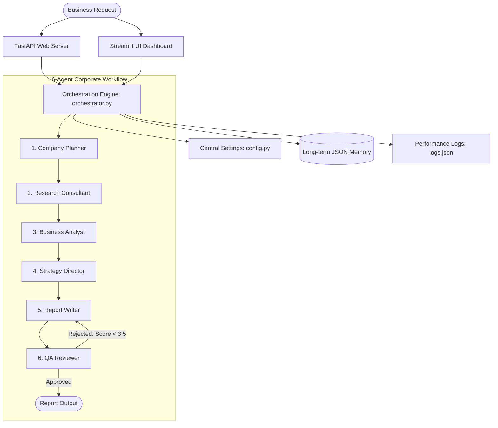

# Synapse AI — Production Multi-Agent Orchestration Platform (v1.0)

Synapse AI is a production-grade multi-agent AI orchestration platform designed to automate complex business consulting and go-to-market strategies. Built on a modular Python architecture, the platform coordinates specialized AI agents (planning, research, analysis, strategy, reporting, and quality assurance) using shared memory, custom error boundaries, telemetry monitoring, and validation feedback loops.

---

## Architecture Diagram



---

## Key Features

- **6-Agent Orchestration Workflow**: Fully automates complex business research through Planner, Researcher, Analyst, Strategist, Report Writer, and Reviewer (QA) agents.
- **Provider Agnostic Client Factory**: Unified structured generation support using Google Gemini (preferred) or OpenAI.
- **Centralized Settings Management**: Zero-hardcoding configuration manager (`config.py`) loading default models, timeouts, temperature, and limits from env variables.
- **Custom Error Boundaries**: Captures API limits or parse issues and translates them to structured custom exceptions (`ProviderUnavailableError`, `ValidationError`, `MemoryError`, `SearchToolError`).
- **Telemetry & Logging**: Records timestamps, latency metrics, character sizes, retry counts, and status logs into console outputs and `logs.json`.
- **Dynamic Streamlit Dashboard**: Displays active executing agents, step-by-step progress bars, and historical execution performance logs.
- **FastAPI Endpoint**: Includes a `/run` workflow execution endpoint and a `/health` check path verifying memory, provider, and log access.

---

## Folder Structure

```text
Synapse AI/
│
├── HLD_SPECS.md          # High-Level Design specifications
├── README.md             # Project documentation
│
└── synapse_agents/       # Unified core package
    ├── config.py         # Config settings & env variables manager
    ├── exceptions.py     # Custom exception classes
    ├── client.py         # Provider client factory (llm_call)
    ├── schemas.py        # Pydantic models for structured schema outputs
    ├── prompts.py        # System prompt templates
    ├── tools.py          # Core KB & market intelligence query tools
    ├── memory.py         # Session & long-term report memory stores
    ├── monitoring.py     # Execution loggers & telemetry aggregation
    ├── orchestrator.py   # 2-agent, 4-agent, and 6-agent loop runners
    ├── app.py            # FastAPI endpoints server
    ├── dashboard.py      # Streamlit GUI monitor dashboard
    └── main.py           # CLI runner script
```

---

## Installation & Setup

1. **Clone the Repository**:
   ```bash
   git clone https://github.com/Shubham11440/synapse-ai-multi-agent.git
   cd "Synapse AI"
   ```

2. **Initialize Virtual Environment**:
   ```bash
   python -m venv venv
   # Activate on Windows:
   .\venv\Scripts\Activate.ps1
   # Activate on Linux/macOS:
   source venv/bin/activate
   ```

3. **Install Dependencies**:
   ```bash
   pip install -r synapse_agents/requirements.txt
   ```

---

## Configuration

Configure environment variables by creating `synapse_agents/.env` or setting environment exports:

```env
# API Keys (Set at least one)
GEMINI_API_KEY=your_google_gemini_key
# OPENAI_API_KEY=your_openai_api_key

# Options (Defaults will apply if left blank)
DEFAULT_MODEL=gemini-2.5-flash
LLM_TEMPERATURE=0.2
LLM_TIMEOUT_SECONDS=30.0
MAX_API_RETRIES=3
MAX_REVIEWER_RETRIES=1
RATE_LIMIT_SLEEP_SECONDS=5
```

---

## Usage Guide

### 1. Running the CLI Runner
Execute scenarios directly from your shell terminal:
```bash
# Run the 6-agent company workflow (default)
python synapse_agents/main.py --mode company

# Run the 4-agent business analyst pipeline
python synapse_agents/main.py --mode 4agent

# Run the 2-agent summarization pipeline
python synapse_agents/main.py --mode 2agent

# Run all workflows back-to-back
python synapse_agents/main.py --mode all
```

### 2. Launching the FastAPI Web Server
Start the FastAPI backend endpoint:
```bash
uvicorn synapse_agents.app:app --reload --port 8000
```
- Open [http://127.0.0.1:8000/](http://127.0.0.1:8000/) in your browser to redirect to the interactive Swagger UI `/docs` page.
- Test system health at [http://127.0.0.1:8000/health](http://127.0.0.1:8000/health).

### 3. Launching the Streamlit UI Dashboard
Start the visual dashboard:
```bash
streamlit run synapse_agents/dashboard.py
```
Submit business queries via the sidebar, watch active agent progress bars, and inspect live performance metric tables in real-time.

---

## API Examples

### Execute Workflow
**Request**:
```bash
curl -X 'POST' \
  'http://127.0.0.1:8000/run' \
  -H 'accept: application/json' \
  -H 'Content-Type: application/json' \
  -d '{
  "query": "Create GTM plan for support automation",
  "mode": "company"
}'
```

**Response**:
```json
{
  "status": "success",
  "mode": "company",
  "query": "Create GTM plan for support automation",
  "latency_ms": 42150,
  "result": {
    "planner_output": {
      "objective": "Determine launch opportunity for support automation",
      "subtasks": ["subtask 1", "subtask 2"],
      "assigned_agents": ["research_agent", "analyst_agent"],
      "estimated_complexity": "medium"
    },
    "final_report": {
      "executive_summary": "GTM business case summary details...",
      "key_points": ["Fact 1", "Fact 2"],
      "next_steps": ["Priority 1", "Priority 2"]
    }
  }
}
```

---

## Future Roadmap

- **Multi-Vector Database Integration**: Replace JSON long-term storage with ChromaDB or PGVector for semantic lookup scaling.
- **Async Execution loops**: Introduce `asyncio` parallel researcher search workers to reduce GTM query latency.
- **Custom Agent Prompts Builder**: Add a dashboard configuration editor to customize agent prompts on the fly.

---

## License

This project is licensed under the MIT License — see the LICENSE file for details.
